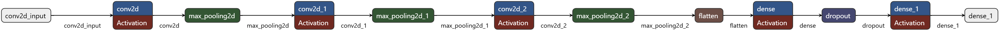

# ImageClassifierPython
The first half of a binary image classification project, where a set of powerline insulator images are classified as "normal" or "abnormal" by a neural net

The second half of this project is a C# application, using Tensorflow and Emgu CV, that will deploy this trained model on similar images. 

Below is an image of the network structure. It is clearly a simple CNN structure (The image here was created using Netron, which is a very useful network visualizer!)

